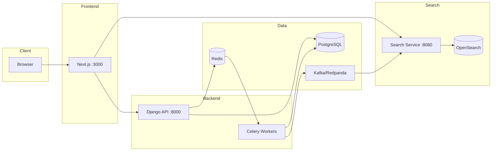

# Tutors Marketplace

**Full-stack marketplace** demonstrating modern web architecture:

- **Event-driven microservices** — Django publishes to Kafka, Go service consumes and indexes to OpenSearch
- **Type-safe API integration** — OpenAPI schema → auto-generated TypeScript types + React Query hooks
- **Real-time features** — WebSocket chat via Django Channels, Redis pub/sub
- **Background processing** — Celery workers for async tasks, scheduled jobs with Beat
- **Feature flags** — Unleash for A/B testing and gradual rollouts
- **JWT authentication** — SimpleJWT with Google/GitHub OAuth support
- **12-factor app** — fully containerized with Docker Compose (12 services)

## Why This Project Matters

**What is it?**
A tutors booking platform where students find and book lessons with verified tutors.

**Problems it solves:**
- Tutor discovery with full-text search and filters (subject, rate, location)
- Lesson booking with calendar scheduling
- Real-time chat between tutors and students
- Instant search results via event-driven indexing

**Architecture patterns demonstrated:**
- Event-driven architecture with Kafka (CQRS-like read model projection)
- Microservices communication (Django → Kafka → Go → OpenSearch)
- Background job processing with Celery (task queues, scheduled jobs)
- WebSocket real-time communication with Redis pub/sub
- OAuth 2.0 social login (Google, GitHub) with NextAuth.js v5
- Feature flag management for controlled rollouts

**Development practices:**
- Type-safe API contract (OpenAPI 3.1 → generated TypeScript + React Query hooks)
- Monorepo with independent frontend/backend deployments
- Containerized development (12 services orchestrated with Docker Compose)
- Automated code quality (Biome, Ruff, Husky pre-commit hooks)
- Testing strategy (Vitest + MSW for frontend, pytest + factory-boy for backend)

## Demo

> 🚧 **Coming soon** — Live demo link

<!-- TODO: Add screenshots when UI is finalized


-->

## Technical Highlights

| Layer | Stack |
|-------|-------|
| Frontend | Next.js 15, React 19, TypeScript, Tailwind CSS 4, TanStack Query, Zustand |
| Backend | Django 5.2 LTS, DRF, Django Channels, Celery |
| Auth | NextAuth.js v5, Google/GitHub OAuth, JWT (SimpleJWT) |
| Search | Go 1.23 microservice, OpenSearch 2.19 |
| Database | PostgreSQL 17, Redis 7.4 |
| Messaging | Kafka (Redpanda) for event-driven architecture |
| Real-time | WebSockets (Django Channels), Redis Channel Layer |
| Feature Flags | Unleash for A/B testing |
| Infra | Docker Compose (12 services), MinIO S3, Daphne ASGI |
| Quality | Biome, Ruff, Husky, Vitest, pytest, MSW |

## Quick Start

```bash
git clone <repo-url> && cd nextjs-django-tutors
make up
make migrate
docker compose exec backend python manage.py seed --count 20
make check  # Run linters + tests
```

Open http://localhost:3000 (frontend) or http://localhost:8000/api/docs/ (API).

→ See [GETTING_STARTED.md](GETTING_STARTED.md) for details.

## Architecture



## API

REST API with OpenAPI 3.1 schema. Interactive docs at http://localhost:8000/api/docs/

## License

MIT
